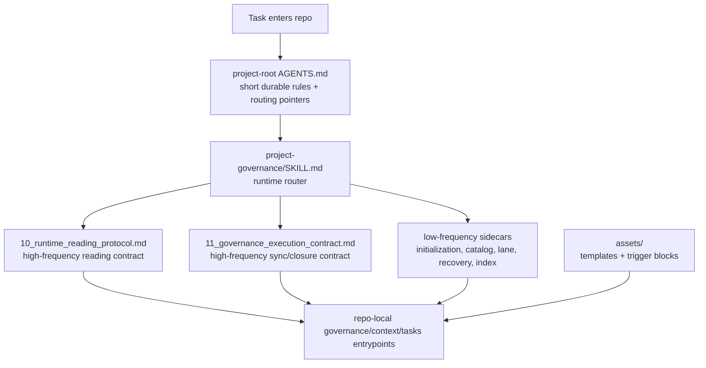

# Project Governance Skill

[中文说明](./README.zh-CN.md)

This repository packages a reusable Codex skill for project-scoped governance in long-running or governance-sensitive repositories. The current version is structured around a runtime router, focused support protocols, and lean project-root `AGENTS.md` routing rather than one giant monolithic workflow file.

## Architecture



## Repository Layout

```text
project-governance-skill/
  README.md
  README.zh-CN.md
  docs/
    USAGE.md
  project-governance/
    SKILL.md
    10_runtime_reading_protocol.md
    11_governance_execution_contract.md
    initialization-and-adoption.md
    governance-surface-catalog.md
    lane-reference.md
    recovery-method-reference.md
    index-summary-reference.md
    agents/openai.yaml
    assets/
    references/
```

## What Ships In The Skill

- `SKILL.md`: runtime router and high-level governance boundary
- `10_runtime_reading_protocol.md`: route-first reading contract
- `11_governance_execution_contract.md`: sync, update/notify, review, quality, and closure rules
- low-frequency sidecars:
  - initialization/adoption
  - governance surface catalog
  - lane reference
  - recovery method reference
  - index/summary reference
- `assets/`: governance templates, project-root `AGENTS.md` template, task templates, summary/index helpers, and maintenance-threshold trigger blocks

## Core Design Ideas

### 1. Keep the main skill as a runtime router

The main `SKILL.md` is intentionally not the place for every detail. Its job is to:

- define precedence and truth boundaries
- classify the current governance-sensitive action
- route the current round into only the support file or sidecar it actually needs

This keeps high-frequency runtime attention focused on the active decision rather than on low-frequency setup material.

### 2. Split high-frequency runtime rules from low-frequency reference material

The two support protocols are first-class entrypoints:

- `10_runtime_reading_protocol.md`
- `11_governance_execution_contract.md`

They hold the rules that agents repeatedly need during real work. Lower-frequency materials stay in sidecars so the lead file does not become diffuse.

### 3. Keep project-root `AGENTS.md` short and durable

The bundled `project-root-AGENTS.template.md` is designed to:

- carry only short durable collaboration rules
- route into the full reading or execution protocol when the current action actually needs them
- avoid embedding a weak summary copy of the full workflow in always-loaded text

This reduces duplicated sources of truth and avoids paying every round for governance details that are only sometimes needed.

### 4. Use structured progressive disclosure instead of bulk reads

The reading contract is route-first and class-based:

- external routing first
- internal routing second
- controlled probing last

The skill distinguishes routing docs, authoritative docs with internal structure, large registries, recovery shards, and low-frequency sidecars. This is meant to reduce large raw reads and make repository reading more deliberate.

### 5. Use trigger-style reminders at the right nodes

The design uses short trigger mechanisms instead of heavy always-loaded prose:

- runtime node triggers in the orchestration/governance flow help the model re-focus before critical actions
- `Maintenance Threshold` blocks in templates/docs simulate “please tell the user this surface should be split or re-indexed” behavior when documents grow too large

The goal is attention control, not verbosity.

### 6. Preserve stable entrypoints while splitting below them

The governance model treats these as stable read-first entrypoints:

- `00_index_and_priority.md`
- `00_context_index.md`
- `00_task_knowledge_base.md`
- `10_runtime_reading_protocol.md`
- `11_governance_execution_contract.md`

If one becomes too large, keep the filename stable and split beneath it with second-level routing instead of renaming the entrypoint itself.

## Installation

### Install as a global Codex skill

Copy the `project-governance/` directory into:

```text
<CODEX_HOME>/skills/project-governance/
```

### Install as a project-local skill

Copy the same `project-governance/` directory into:

```text
<repo>/.agents/skills/project-governance/
```

## Usage

See [docs/USAGE.md](./docs/USAGE.md) for runtime order, initialization/adoption routing, and example prompts.

## Notes

- Repository-local governance docs remain the authority for a specific repository.
- This packaged skill provides workflow, routing, and templates; it does not override repo-local accepted truth.
- The reference files are support material. They should not become a shadow authority source.
