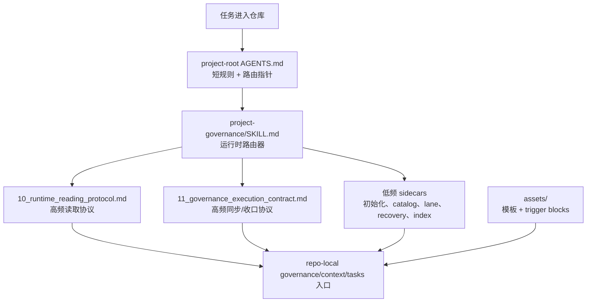

# Project Governance Skill

[English](./README.md)

这个仓库打包了一个可复用的 Codex skill，用于长周期项目或治理敏感仓库中的项目级治理。当前版本不再把所有规则塞进一个大文件里，而是改成“运行时路由器 + 高频协议文件 + 低频 sidecar + 精简 AGENTS 模板”的结构。

## 架构图



## 仓库结构

```text
project-governance-skill/
  README.md
  README.zh-CN.md
  docs/
    USAGE.md
  project-governance/
    SKILL.md
    10_runtime_reading_protocol.md
    11_governance_execution_contract.md
    initialization-and-adoption.md
    governance-surface-catalog.md
    lane-reference.md
    recovery-method-reference.md
    index-summary-reference.md
    agents/openai.yaml
    assets/
    references/
```

## Skill 内包含什么

- `SKILL.md`：运行时路由器与高层治理边界
- `10_runtime_reading_protocol.md`：route-first 读取协议
- `11_governance_execution_contract.md`：sync、update/notify、review、quality、closure 规则
- 低频 sidecars：
  - 初始化 / 接管
  - 治理面目录
  - lane 参考
  - recovery 方法参考
  - index / summary 参考
- `assets/`：治理模板、project-root `AGENTS.md` 模板、task 模板、summary/index 辅助，以及 `Maintenance Threshold` 触发块

## 核心设计思想

### 1. 主 skill 只做运行时路由

主 `SKILL.md` 有意不再承载所有细节。它的职责是：

- 定义 precedence 和 truth boundary
- 判断当前 governance-sensitive action 属于哪一类
- 把当前轮次路由到真正需要读取的 support file 或 low-frequency sidecar

这样高频运行时注意力会落在当前决策上，而不会被低频初始化材料稀释。

### 2. 高频规则和低频参考分层

两个 support protocol 是一等入口：

- `10_runtime_reading_protocol.md`
- `11_governance_execution_contract.md`

真实工作中反复需要的规则放在这里；低频材料则下沉到 sidecar，避免主文件又长又散。

### 3. project-root `AGENTS.md` 模板保持短而耐用

内置的 `project-root-AGENTS.template.md` 设计目标是：

- 只承载短小、持久的协作规则
- 在当前动作真的需要时，把读取者路由到完整的 reading / execution protocol
- 避免在每轮常驻输入里塞一个“弱化版完整工作流”

这样可以减少重复真相源，也避免每轮都为低频治理细节付 token。

### 4. 用结构化渐进式披露替代大段读取

读取协议采用 route-first、按文档类型处理的方式：

- external routing first
- internal routing second
- controlled probing last

这个 skill 会区分 routing docs、带内部结构的 authoritative docs、大型 registry、recovery shards、低频 sidecars。目的就是减少大段 raw 读取，让仓库读取变成有意图的窄读取。

### 5. 用触发器思想做注意力控制

这里的设计不是“把说明写得越来越长”，而是把短触发器埋到正确节点：

- 在运行时关键节点加短 trigger，帮助模型在关键动作前重新聚焦
- 在模板/文档里放 `Maintenance Threshold` 块，让 agent 在文档过长时更容易显式提醒用户拆分或建索引

目标是控制注意力，而不是增加噪音。

### 6. 稳定入口保留，拆分发生在其下层

当前治理模型把这些视为稳定 read-first entrypoints：

- `00_index_and_priority.md`
- `00_context_index.md`
- `00_task_knowledge_base.md`
- `10_runtime_reading_protocol.md`
- `11_governance_execution_contract.md`

如果它们过长，原则是保留文件名稳定，把拆分放到其下层做二级路由，而不是频繁改入口名。

## 安装

### 作为全局 Codex skill 安装

把 `project-governance/` 目录复制到：

```text
<CODEX_HOME>/skills/project-governance/
```

### 作为项目级本地 skill 安装

把同一个 `project-governance/` 目录复制到：

```text
<repo>/.agents/skills/project-governance/
```

## 使用

运行时顺序、初始化/接管路由和示例提示词见 [docs/USAGE.md](./docs/USAGE.md)。

## 说明

- 对某个具体仓库而言，repo-local governance docs 仍然是 authority。
- 这个打包 skill 提供的是 workflow、routing 和模板，不覆盖 repo-local 的已接受真相。
- `references/` 里的内容是辅助材料，不应变成 shadow authority source。
